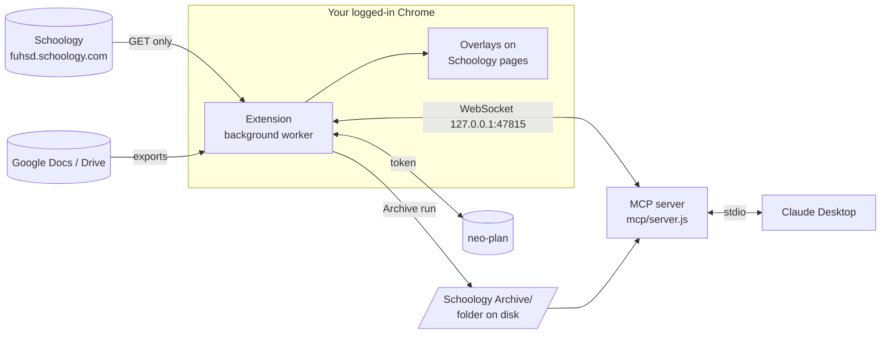

# Schoology Toolkit

Keep your Schoology coursework after the term ends, see more on Schoology's own pages, and let Claude help you study from it.

This repo has two parts:

| Part | Folder | What it does | Version |
|---|---|---|---|
| **Chrome extension** ("Schoology Course Archiver") | [`schoology_archiver_extension/`](schoology_archiver_extension/) | Archives whole courses to disk, adds overlays to Schoology pages (grades what-if, To Do, material markers), and syncs with neo-plan | **1.10.0** |
| **MCP server** (`schoology-mcp`) | [`mcp/`](mcp/) | Lets Claude Desktop read your Schoology: to-do, grades, assignments, materials, and the archive | **1.1.0** |

Everything runs on your own Mac, through your normal Schoology login in Chrome. Nothing is sent anywhere except to Schoology, Google (for Docs exports), and neo-plan if you give it a token.

---

## Contents

- [How the parts fit together](#how-the-parts-fit-together)
- [Quick start](#quick-start)
- [1. The Chrome extension](#1-the-chrome-extension)
  - [Install](#install)
  - [Archive a course](#archive-a-course)
  - [What the archive looks like](#what-the-archive-looks-like)
  - [Overlays on Schoology pages](#overlays-on-schoology-pages)
  - [neo-plan sync](#neo-plan-sync)
  - [Stopping a run](#stopping-a-run)
  - [Quiz safety](#quiz-safety)
- [2. The MCP server (Claude Desktop)](#2-the-mcp-server-claude-desktop)
  - [Set it up](#set-it-up)
  - [Tools](#tools)
  - [Example prompts](#example-prompts)
  - [Course websites](#course-websites-sitesjson)
  - [Environment variables](#environment-variables)
- [Troubleshooting](#troubleshooting)
- [Development](#development)
- [Versioning and releases](#versioning-and-releases)
- [More documentation](#more-documentation)

---

## How the parts fit together



- The **extension** is the only part that talks to Schoology. It reads pages with your existing login (the Schoology API is turned off for students in this district, so there is no API key to set up).
- The **archive** is plain files: PDFs, Markdown, spreadsheets. You can open it in Finder or hand it to any AI tool.
- The **MCP server** gives Claude three sources, best first: **live** (asks the extension right now), **snapshot** (the extension's last background read, cached on disk), and **archive** (the folder). Every answer says which source it used and how old it is.

---

## Quick start

About five minutes if you only want the archive, ten with Claude.

```bash
git clone https://github.com/obfuscated-tm/schoology_downloader.git
```

1. **Load the extension:** open `chrome://extensions`, turn on **Developer mode**, click **Load unpacked**, and pick the `schoology_archiver_extension` folder.
2. **Archive a course:** open any course in Schoology, click **Archive** (bottom left), then **Archive this course**. Files land in `Downloads/Schoology Archive/<Course name>/`.
3. **(Optional) Connect Claude:** install the MCP server and add it to Claude Desktop (see [Set it up](#set-it-up)).

---

## 1. The Chrome extension

### Install

1. Open `chrome://extensions`.
2. Turn on **Developer mode** (top right).
3. Click **Load unpacked** and choose `schoology_archiver_extension/`.
4. Pin it: puzzle-piece icon → pin **Schoology Course Archiver**.

Requires Chrome 116 or newer.

> **After you change any file in the extension,** click the ↻ reload button on its card in `chrome://extensions`, then reload your Schoology tabs.

### Archive a course

1. Open a course in Schoology.
2. Click the **Archive** button next to the overlay switch in the bottom-left corner. A card opens, already pointed at that course.
3. Click **Archive this course**.

The run keeps going if you close the card or leave the page. Reopen the card on any Schoology page to watch progress. Only one archive runs at a time.

**Run it again whenever you like.** Only new or changed items are downloaded, so a weekly re-run is quick. Always run it once more before the term ends, because Schoology deletes courses.

**Choosing where files go.** By default they go to `Downloads/Schoology Archive` with no Save dialogs. To use another folder, click the extension's toolbar icon → **Save archives to** → **Choose folder…**. If Chrome asks, pick **Allow on every visit**.

### What the archive looks like

```text
Schoology Archive/
└── AP Computer Science A/
    ├── INDEX.md                          ← start here: everything, recent changes, failures
    ├── grades.md                         ← the gradebook
    ├── updates.md                        ← announcements
    ├── Unit 1 - Primitive Types/
    │   ├── Lecture Slides.pdf            ← Google Slides, exported to PDF
    │   ├── Guided Notes.pdf
    │   ├── Practice Set.xlsx             ← Google Sheets, exported to .xlsx
    │   ├── HW 1.2 (assignment).md        ← instructions, due date, grade, comments
    │   └── HW 1.2 files/
    │       ├── starter.java              ← teacher's attachment
    │       └── My submission.pdf         ← your submission (every revision)
    ├── Unit 1 Quiz (assignment).md       ← questions, your answers, right/wrong
    └── _archive/
        └── manifest.json                 ← change tracking (don't edit)
```

| In Schoology | In the archive |
|---|---|
| Folders | The same folder tree |
| Uploaded files (PDF, slides, images) | The original file, named after its Schoology title |
| Google Docs / Slides / Drawings | Exported PDF |
| Google Sheets | `.xlsx` |
| Google Drive files | The file itself |
| Assignments | `Title (assignment).md` plus a `Title files/` folder with attachments and **your submissions** |
| Older Test/Quiz assignments | Every question, the choices, what you picked, and whether it was right |
| Newer quizzes ("assessments") | Description, grade, attempts. Questions and answers only if the teacher allows review |
| External tools (LTI) | Title, due date, grade, marked as external |
| Pages, discussions | `.md` text |
| Gradebook | `grades.md` |
| Announcements | `updates.md` |
| Google Forms, Drive folders, YouTube, websites | Listed in `INDEX.md` as links |

**Nothing is ever overwritten or lost:**

- **The teacher edits a file:** the new version is saved next to the old one, e.g. `Notes (updated 2026-10-01).pdf`.
- **The teacher deletes something:** your copy stays and is listed under "Removed from Schoology" in `INDEX.md`.
- **You delete a file from the archive:** it downloads again on the next run.
- **Re-download everything** in the card ignores the history and fetches it all again.

### Overlays on Schoology pages

The overlays only **add** to Schoology's pages. They never click, submit, or change anything of Schoology's. Turn them all off with the switch in the bottom-left corner.

| Page | What you get |
|---|---|
| **Home** | A To Do column grouped by class, with full dates, overdue days in red, and a tag for each item's type in neo-plan (**TEST**, **HW**, **CW**, **TASK**, **MEET**) |
| **A course's pages** | That course's own To Do in place of Schoology's Upcoming column |
| **Materials** | **Only open work** filter; per folder: what's open (e.g. "1 missing · 1 to turn in") and its scored %; per assignment: one status marker |
| **Assignment** | A status chip (Missing, Submitted, Late by N days, what a zero would cost), a **What if I get [ ] / pts** box, and the folder's other items |
| **Grades** | A graph of your grade over the term, distance above the A cutoff, how low each category can drop, each item's impact, what-if scores, and **Plan an upcoming test** ("you need 87% for an A") |

Markers are colour-coded: green **Submitted**, blue **Done, not submitted**, grey **To do**, red **Missing**. Click **To do** / **Done, not submitted** or **Not studied** / **Studied** to flip it in neo-plan.

Roughly what the Grades overlay tells you (illustrative numbers):

```text
Tests & Quizzes (50%)         can drop to 88.4% and keep the A
  Unit 3 Test   45/50  90%    impact −0.62
  Unit 4 Test   [ what if ]   → course grade 94.1%
+ Plan an upcoming test       need 41/50 (82%) for an A
```

> The A cutoff is assumed to be **93%**. If a category shows no weight, type it next to the category name; it's saved per course.

### neo-plan sync

[neo-plan](https://neo-plan.vercel.app) is a separate planner app. The extension can feed it from Schoology. This is optional: the archive and overlays work without it.

1. In neo-plan, open **Settings** and make an extension token (it starts with `np_`).
2. Open the extension's Settings (toolbar icon, or the gear on any Schoology page), paste the token into **Token**, and click **Save**.

Once a token is saved, the extension reads Schoology in the background:

- every 15 minutes while Chrome is open,
- when a Schoology page loads (at most every 5 minutes),
- when you click **Check now** in Settings.

It only reads (GET requests). neo-plan then files items into the right column, clears work Schoology shows as submitted, and flags what the gradebook marks Missing. It never creates items on its own. **Settings → Courses** lets you change which neo-plan column each class files into.

The token stays in the extension's background worker. Schoology pages never see it.

### Stopping a run

Either of these stops an archive **immediately**. No half-written files are left behind.

- **■ Stop now** in the Archive card
- **Alt+Shift+K** from any tab (change it at `chrome://extensions/shortcuts`)

The next run continues where the stopped one left off.

### Quiz safety

The extension is built so it can never interfere with a test.

- **It never starts a quiz.** It refuses quiz-taking URLs outright and never presses Start, Resume, Continue, or Submit. To save answer reviews it clicks only links whose whole text is **View** in your Previous Attempts table.
- **Quiet mode:** while **any** tab is on a Test/Quiz page, the extension does nothing in the background. No sync, no MCP bridge, no archive. It resumes by itself once the quiz tab is closed.
- **No overlays on quiz or dropbox-submit pages.**

---

## 2. The MCP server (Claude Desktop)

A local, read-only [MCP](https://modelcontextprotocol.io) server. Claude Desktop starts it over stdio. No data leaves your Mac except what Claude Desktop itself sends.

### Set it up

**Requirements:** Node.js 18 or newer (tested on Node 25).

```bash
cd mcp
npm install
```

Open Claude Desktop's config file (on macOS, `~/Library/Application Support/Claude/claude_desktop_config.json`) and add the server. Use **absolute paths** — find yours with `which node` and `pwd`:

```json
{
  "mcpServers": {
    "schoology": {
      "command": "/opt/homebrew/bin/node",
      "args": ["/Users/you/path/to/schoology_downloader/mcp/server.js"]
    }
  }
}
```

Restart Claude Desktop. Then check it's working:

- In Claude, ask "What's the status of my Schoology connection?" It calls the `status` tool.
- In the extension's **Settings → Claude**, you should see **Connected** while Chrome is open.

To test the server by itself:

```bash
node mcp/server.js
```

You should see:

```text
[schoology-mcp] bridge: listening on ws://127.0.0.1:47815
[schoology-mcp] MCP server connected over stdio
```

If ports 47815–47819 are all taken, it says so and runs without **live**. Every tool still works from the snapshot and archive.

### Tools

All tools are read-only and return `{ source: "live" | "snapshot" | "archive", as_of, ... }`.

| Tool | Arguments | Sources | What it returns |
|---|---|---|---|
| `status` | — | — | Extension connected?, bridge port, last snapshot, archive path, archived courses, course websites |
| `list_courses` | — | live → snapshot → archive | Your courses, which have an archive, and any course website |
| `get_todo` | — | live → snapshot → archive | What's due, soonest first |
| `get_grades` | `course` | live → archive | The gradebook |
| `get_assignment` | `course?`, `id?`, `title?` | live → archive | Instructions, due date, grade, attachments |
| `get_updates` | `course`, `page?` | live → archive | Announcements |
| `list_materials` | `course`, `folder_id?`, `path?`, `depth?` | live → archive | A course's folders and items |
| `open_material` | `course?`, `url?`, `id?`, `fetch_files?` | **live only** | One item's body, links, and up to 5 attached files (PDF as text, images as images) |
| `fetch_page` | `url` | web | A public course website page as text (see [below](#course-websites-sitesjson)) |
| `read_file` | `path` | **archive only** | One archived file: text, PDF text, or an image |
| `search` | `query`, `course?` | **archive only** | Matches in file names, text, and PDF contents, with snippets |

A `course` argument takes a section ID or any part of the course name, case-insensitive: `"apcs"`, `"comp sci"`, and `"8141837521"` all work. An ambiguous name returns the matching candidates.

### Example prompts

Paste these into Claude Desktop once the server is connected.

**What's due**
> What do I have due this week? Put anything missing or overdue first.

**Grades**
> What's my grade in Pre-Calc, and which category is pulling it down the most?

**Studying for a test**
> I have a Unit 3 test in AP Comp Sci on Friday. List the Unit 3 materials, read the slides and guided notes, and quiz me one question at a time. Don't show me the answer key until I've answered.

**Finding something**
> Search my archive for "unit circle" and tell me which files cover it.

**Reading an assignment**
> Open the "HW 2.4" assignment in Chemistry and explain what it's asking for. Don't do it for me.

**Catching up**
> Summarize any teacher announcements from the last two weeks across all my classes.

**Tip:** Claude works best when it knows the trade-off. Live data is current but needs Chrome open; the archive works offline but may be out of date. If an answer says `source: "archive"` and you need current info, open Chrome and ask again.

#### Using the archive without MCP

The archive is plain files, so any AI tool that reads a folder (Claude Cowork, Projects, etc.) can use it. Point it at `Schoology Archive/<Course>/` and start with:

> Read INDEX.md first. Then quiz me on Unit 2 using the lecture slides and guided notes. Don't show me answer keys until I've answered.

### Course websites (`sites.json`)

Some classes keep lessons on a public website outside Schoology. List them in [`mcp/sites.json`](mcp/sites.json) so Claude knows they exist and can read them with `fetch_page`:

```json
[
  {
    "course": "AP Comp Sci",
    "url": "https://apcs.tinocs.com/",
    "note": "Lessons are plain .md pages, e.g. https://apcs.tinocs.com/lesson/A1/A.md"
  }
]
```

- `course` is matched as part of the course name, case-insensitive.
- `note` is optional. Use it for quirks, like where PDFs live or a URL pattern.
- The repo already lists sites for AP Comp Sci, Pre-Calculus (the Larson textbook solutions), World History (the textbook PDF Drive folder), and French (a grammar reference).
- The file is read once at startup. **Restart Claude Desktop** after editing it.

`fetch_page` is guarded: no cookies, a 15-second timeout, a 15 MB cap, at most 5 redirects, and no requests to local or private network addresses.

### Environment variables

All optional. Set them in the `env` block of the Claude Desktop config.

| Variable | Default | Meaning |
|---|---|---|
| `SCHOOLOGY_ARCHIVE` | `../Schoology Archive` (relative to `mcp/`) | Where your archive folder is |
| `SCHOOLOGY_EXT_ID` | unset | Only accept the bridge connection from this extension ID (find it in `chrome://extensions`) |
| `SCHOOLOGY_MCP_HOME` | `~/.schoology-mcp` | Where the snapshot cache, PDF text cache, and downloaded-file cache live |

> **Where is my archive?** The extension saves to `Downloads/Schoology Archive` by default, but the MCP server looks in `../Schoology Archive` next to `mcp/`. Either choose the repo folder as the extension's **Save archives to** folder, or set `SCHOOLOGY_ARCHIVE`:

```json
{
  "mcpServers": {
    "schoology": {
      "command": "/opt/homebrew/bin/node",
      "args": ["/Users/you/path/to/schoology_downloader/mcp/server.js"],
      "env": {
        "SCHOOLOGY_ARCHIVE": "/Users/you/Downloads/Schoology Archive",
        "SCHOOLOGY_EXT_ID": "abcdefghijklmnopabcdefghijklmnop"
      }
    }
  }
}
```

---

## Troubleshooting

| Problem | Fix |
|---|---|
| **No Archive button or overlays** | Reload the extension in `chrome://extensions`, then reload the Schoology tab. Check the overlay switch (bottom left) is on. |
| **Overlays disappeared on a quiz page** | Expected. The extension stays off quiz pages and pauses everything while one is open. |
| **Archive stopped partway** | Open the card again and restart. It continues where it left off. If you were signed out of Schoology, sign in first. |
| **Save dialogs pop up during an archive** | Rare fallback for files that can't be fetched directly. Turn off "Ask where to save each file" in Chrome's download settings. |
| **A Google file shows as a link, not a file** | It isn't shared with you, or it's too big for Google's virus scan. The link and error are in `INDEX.md`. |
| **Folder picker does nothing** | Pick the folder from the extension's own tab (toolbar icon), not the gear popover on Schoology. |
| **Settings says "Reload extension"** | The background worker didn't answer. Reload it in `chrome://extensions`. |
| **"neo-plan needs an update"** | That feature needs a newer neo-plan. Everything else still works. |
| **Claude says `source: "archive"` / extension not connected** | Open Chrome with any Schoology tab. Check **Settings → Claude**. Make sure no quiz tab is open. |
| **Claude can't find the archive** | Set `SCHOOLOGY_ARCHIVE` to the right folder (see [Environment variables](#environment-variables)) and restart Claude Desktop. |
| **MCP server doesn't appear in Claude** | Use absolute paths for both `node` and `server.js`, run `npm install` in `mcp/`, and fully quit and reopen Claude Desktop. Run `node mcp/server.js` to see errors. |
| **Log says "bridge: no free port in 47815-47819"** | Something else is using those ports (often a second copy of the server). Quit it, or run without live data. |

### Known limits

- **Quizzes:** questions and answers are saved only where the teacher allows review. Unfinished or never-taken quizzes are left alone.
- **Announcements, discussions, media albums, SCORM packages:** saved, but not yet tested against a course that uses them.
- **Change history is stored in the extension.** Removing the extension loses the history (the next run starts fresh), but your files stay.

---

## Development

### Layout

```text
schoology_downloader/
├── schoology_archiver_extension/   Chrome extension (Manifest V3, plain ES modules, no build step)
│   ├── manifest.json               version lives here
│   ├── background.js               run lock, kill switch, sync schedule, message routing
│   ├── reader/                     everything that reads Schoology (client.js + parse/)
│   ├── outputs/archive/            the archive run, file saving, change tracking, Google exports
│   ├── outputs/neoplan/            every call to neo-plan
│   ├── outputs/mcp/                the WebSocket bridge to the MCP server
│   ├── sync/                       background sync, scheduling, quiz quiet mode
│   ├── offscreen/                  DOM parsing and the archive job (service workers have no DOM)
│   ├── overlays/                   content scripts drawn on Schoology pages
│   ├── panel/                      Settings page
│   └── test/                       node --test tests + stand-in HTML pages
├── mcp/                            MCP server (Node, ES modules)
│   ├── server.js
│   ├── sites.json                  course websites
│   ├── src/                        tools, bridge, cache, archive reader, PDF text, network guard
│   └── test/
└── docs/                           design docs (bridge contract, overlay UI)
```

The extension's [README](schoology_archiver_extension/README.md) has a file-by-file map.

### Run the tests

```bash
cd schoology_archiver_extension && node --test
```

```bash
cd mcp && npm test
```

As of 1.10.0 / 1.1.0: 170 extension tests and 59 MCP tests, all passing.

### Preview overlays outside Schoology

The `test/*.html` pages are stand-ins for Schoology pages (grades, materials, home, the Archive card). Serve the extension folder and open one:

```bash
python3 -m http.server 8765 --directory schoology_archiver_extension
```

Then open <http://localhost:8765/test/grades-page.html>. (`.claude/launch.json` has this preconfigured.)

### Rules the code follows

- **GET only.** Nothing ever writes to Schoology.
- **Never touch a quiz.** Quiz-taking URLs are refused in `reader/client.js`; quiet mode is in `sync/quiet.js`.
- **Overlays only add.** They draw in their own shadow DOM and never click or change Schoology's page.
- **The neo-plan token stays in the background worker.**
- **The MCP server is read-only** and the bridge binds to `127.0.0.1` only.

---

## Versioning and releases

The extension and the MCP server are versioned separately with [Semantic Versioning](https://semver.org) (`MAJOR.MINOR.PATCH`):

- **MAJOR** — a breaking change: the archive layout changes, the extension↔MCP bridge contract changes incompatibly, or a tool is removed.
- **MINOR** — a new feature: a new overlay, tool, or archived item type.
- **PATCH** — a bug fix with no new behaviour.

| Component | Where the version lives | Git tag format |
|---|---|---|
| Extension | `schoology_archiver_extension/manifest.json` → `"version"` | `ext-v1.10.0` |
| MCP server | `mcp/package.json` → `"version"` | `mcp-v1.1.0` |

The bridge contract in [`docs/MCP-BRIDGE.md`](docs/MCP-BRIDGE.md) is shared. If a change needs both sides, bump both and note the minimum matching version in [`CHANGELOG.md`](CHANGELOG.md).

### Cutting a release

1. Bump the version in `manifest.json` and/or `mcp/package.json`.
2. Add an entry at the top of [`CHANGELOG.md`](CHANGELOG.md).
3. Run both test suites.
4. Commit, then tag:

```bash
git tag -a ext-v1.11.0 -m "Extension 1.11.0"
```

```bash
git push origin main --tags
```

---

## More documentation

| File | What's in it |
|---|---|
| [`schoology_archiver_extension/README.md`](schoology_archiver_extension/README.md) | Full extension reference and code map |
| [`mcp/README.md`](mcp/README.md) | Full MCP server reference |
| [`docs/MCP-BRIDGE.md`](docs/MCP-BRIDGE.md) | The extension↔MCP WebSocket contract: messages, ops, snapshot shape |
| [`docs/OVERLAY-UI.md`](docs/OVERLAY-UI.md) | Overlay design: look, grade math, each page |
| [`EXTENSION-STEPS.md`](EXTENSION-STEPS.md) | The original build plan for the unified extension |
| [`CHANGELOG.md`](CHANGELOG.md) | What changed in each version |
