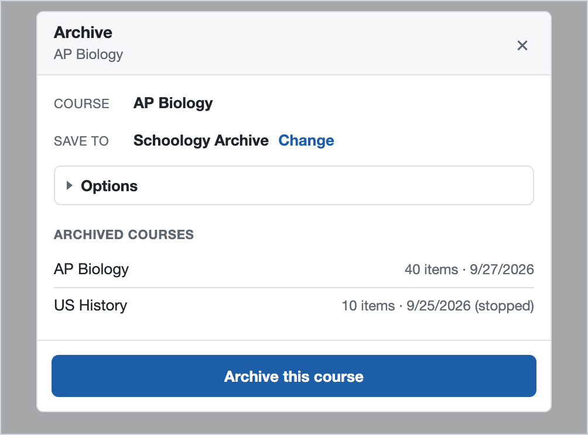
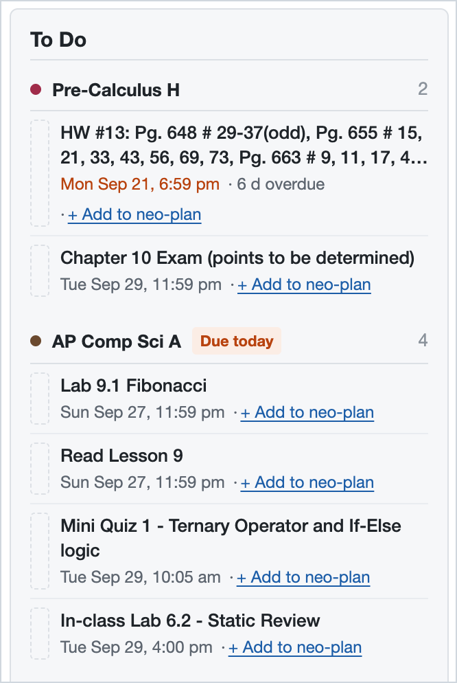
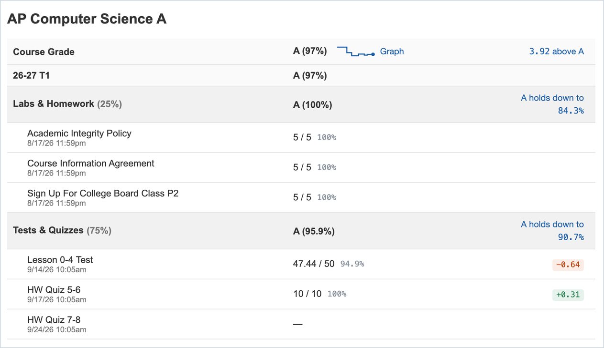
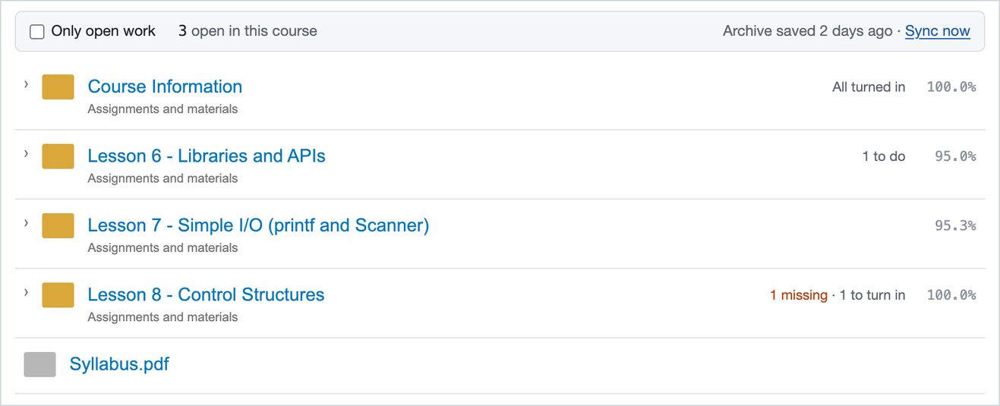
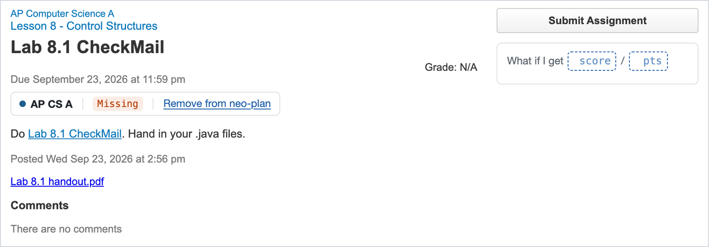
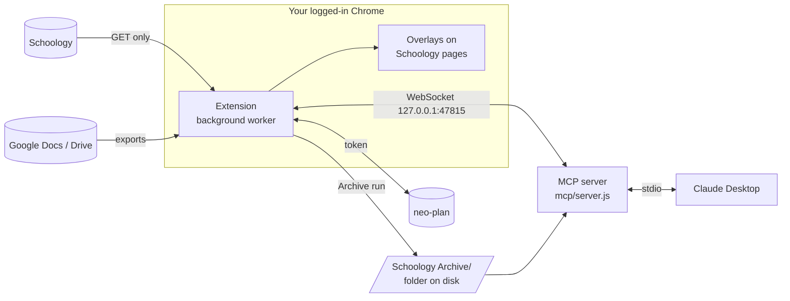

# 📚 Schoology Toolkit

**Save your Schoology classes before they disappear, see what's due and where your grade stands at a glance, and study with Claude.**

A free Chrome extension (plus an optional Claude add-on) for students on any school's Schoology.

  

<p align="center">
  
</p>

---

## ✨ What it does

### 💾 Save a whole course with one click

Schoology deletes classes when the term ends. One click saves everything to a folder on your computer: slides, handouts, Google Docs (as PDFs), assignments, **your own submissions**, quiz answers you're allowed to review, grades, and announcements.

Run it again any time, and it only grabs what's new. If a teacher edits a file, you keep both versions.

### ✅ See what's due, class by class

<table>
<tr>
<td width="45%"></td>
<td>

Your Schoology home page gets a cleaner **To Do** list:

- grouped by class
- the full date and time for everything
- overdue work in **red**, with how many days late
- a **Due today** tag

Each class's own page gets the same list for just that class.

</td>
</tr>
</table>

### 📈 Know exactly where your grade stands

<p align="center"></p>

On any class's **Grades** page you'll see:

- **a graph** of your grade over the term
- **how far above an A** you are ("3.92 above A")
- **how low each category can drop** before you lose the A
- **how much each score moved your grade** (green helped, red hurt)
- a **"what if"** box: type a score you might get and see your new grade
- **Plan an upcoming test**: find out what score you need to keep your A

### 📂 Spot missing work in your Materials

<p align="center"></p>

Every folder shows what's still open ("1 missing · 1 to turn in") and your score in it. Tick **Only open work** to hide everything you've already finished.

### 📝 Check your status on any assignment

<p align="center"></p>

Each assignment shows whether it's **Missing**, **Submitted**, or **Late**, plus a **What if I get \_\_ / \_\_ pts** box to see how a score would change your grade.

### 🤖 Study with Claude (optional)

Connect it to [Claude Desktop](https://claude.ai/download) and just ask:

> **You:** I have a Unit 3 test in AP Bio on Friday. Quiz me on it, one question at a time.
>
> **Claude:** I found 6 files in your Unit 3 folder: the lecture slides, guided notes, and two practice sets. Let's start. Question 1: …

Claude can read what's due, your grades, assignment instructions, and everything in your saved courses.

---

## 🚀 Get started (about 5 minutes)

**You need:** Google Chrome and a Schoology student login. That's it.

### Step 1: Download it

On this page, click the green **Code** button → **Download ZIP**, then double-click the ZIP to unzip it. Move the folder somewhere you'll keep it, like your Documents folder.

<sub>Know git? `git clone https://github.com/obfuscated-tm/schoology_downloader.git` works too.</sub>

### Step 2: Add it to Chrome

1. Type `chrome://extensions` into Chrome's address bar and press Enter.
2. Turn on **Developer mode** (the switch in the top right).
3. Click **Load unpacked**.
4. Open the folder you downloaded and pick the **`schoology_archiver_extension`** folder inside it.
5. Click the 🧩 puzzle piece in Chrome's toolbar and **pin** "Schoology Course Archiver".

> 💡 Chrome may show a "developer mode extensions" notice now and then. That's normal for extensions you install from a folder. Just close it.

### Step 3: Choose where your courses are saved

1. Inside the downloaded folder, make a new folder called **`Schoology Archive`**.
2. Click the extension's icon in Chrome's toolbar.
3. Next to **Save archives to**, click **Choose folder…** and pick that `Schoology Archive` folder.
4. If Chrome asks, choose **Allow on every visit**.

<sub>Skip this and courses go to `Downloads/Schoology Archive` instead. That works fine, but Claude won't find them without an extra setting.</sub>

### Step 4: Save your first course

1. Open Schoology and go to any class.
2. Click **Archive** in the bottom-left corner.
3. Click **Archive this course**.

That's it! 🎉 You can close the card or keep browsing, and it keeps going in the background. Open the card again to check on it.

**Tip:** re-archive every week or so, and **always once more before the term ends**.

---

## 📁 What you get

Each class becomes a normal folder you can open in Finder or File Explorer:

```text
Schoology Archive/
└── AP Biology/
    ├── INDEX.md                     👈 open this first: a list of everything
    ├── grades.md                    your gradebook
    ├── updates.md                   teacher announcements
    └── Unit 1 - Cells/
        ├── Lecture Slides.pdf       Google Slides, saved as a PDF
        ├── Guided Notes.pdf
        ├── Lab 1 (assignment).md    instructions, due date, grade, comments
        └── Lab 1 files/
            └── My submission.pdf    what you turned in
```

| In Schoology | You get |
|---|---|
| Files (PDFs, slides, images) | The original file |
| Google Docs, Slides, Drawings | A PDF |
| Google Sheets | An Excel file |
| Assignments | Instructions, due date, grade, comments, and **everything you submitted** |
| Quizzes | Questions and your answers, if your teacher lets you review them |
| Grades and announcements | `grades.md` and `updates.md` |
| Links, videos, Google Forms | Listed in `INDEX.md` |

**Nothing gets lost.** If a teacher updates a file, the new one is saved next to the old one. If they delete something, your copy stays.

---

## 🤖 Set up Claude (optional)

This lets [Claude Desktop](https://claude.ai/download) read your Schoology. It takes about 5 more minutes.

1. **Install Node.js** from [nodejs.org](https://nodejs.org) (pick the LTS version).
2. **Open Terminal** (Mac) or **Command Prompt** (Windows), go into the downloaded folder, and run:

   ```bash
   cd mcp && npm install
   ```

3. **Tell Claude about it.** In Claude Desktop, open **Settings → Developer → Edit Config**, and paste this in. Change the path to where *your* folder is:

   ```json
   {
     "mcpServers": {
       "schoology": {
         "command": "node",
         "args": ["/Users/you/Documents/schoology_downloader/mcp/server.js"]
       }
     }
   }
   ```

4. **Quit and reopen Claude Desktop.**
5. **Check it works:** ask Claude *"What's my Schoology status?"*

Claude gets the most up-to-date answers while Chrome is open. When Chrome is closed, it uses your saved courses and tells you how old they are.

<sub>If Claude can't start it, replace `"node"` with Node's full path. On a Mac, find it by running `which node`. More help is in [Troubleshooting](#-troubleshooting).</sub>

### Things to ask Claude

| Try asking… | What happens |
|---|---|
| "What do I have due this week?" | Lists your work, with overdue items first |
| "What's my grade in Chemistry, and what's pulling it down?" | Reads your gradebook |
| "Quiz me on Unit 3 for my AP Bio test. Don't show answers until I try." | Reads your slides and notes, then quizzes you |
| "Search my saved classes for 'unit circle'." | Finds every file that mentions it |
| "Explain what the HW 2.4 assignment is asking. Don't do it for me." | Reads the instructions |
| "Any new announcements from my teachers this week?" | Checks announcements in every class |

> 💡 Claude works best as a study buddy. Ask it to quiz you, explain things, or check your understanding, and follow your school's rules on AI.

---

## 🛡️ Is it safe?

- **It only looks, never touches.** It can't submit, post, or change anything on Schoology.
- **It stays out of your tests.** It never opens or starts a quiz. While you have a quiz open, it completely pauses and does nothing until you close it.
- **Your stuff stays on your computer.** Nothing is uploaded anywhere. Your saved courses are ordinary files in a folder you chose.
- **No passwords.** It uses the Schoology login Chrome already has.
- **You can turn it off any time.** Use the switch in the bottom-left corner of Schoology to hide the extra info, or press **Alt+Shift+K** to stop a save instantly.

---

## ❓ Troubleshooting

| Problem | Try this |
|---|---|
| I don't see the **Archive** button | Go to `chrome://extensions`, click ↻ on the extension, then refresh Schoology. Make sure the switch in the bottom-left is on. |
| Everything disappeared while I'm taking a quiz | That's on purpose. It comes back after you close the quiz. |
| A save stopped halfway | Open the card and start it again. It picks up where it left off. If Schoology logged you out, log back in first. |
| Chrome keeps asking where to save files | In Chrome's settings, turn off **Ask where to save each file before downloading**. |
| A Google Doc was saved as a link, not a file | It isn't shared with you, or it's too big. The reason is in `INDEX.md`. |
| The **Choose folder** button does nothing | Click the extension's icon in Chrome's toolbar and choose it there, not from inside Schoology. |
| My letter grades look wrong | Your school probably uses a different grading scale. See [Change the grading scale](#change-the-grading-scale). |
| I see "Add to neo-plan" or "neo-plan needs an update" | You can ignore those. They're for an optional planner app (see [neo-plan](#neo-plan-optional-planner)). |
| Claude doesn't see Schoology | Quit and reopen Claude Desktop. Check the path in the config is right. Try replacing `"node"` with the full path from `which node`. |
| Claude says it's using saved (old) data | Open Chrome with Schoology, and make sure no quiz is open. |
| Claude can't find my saved courses | Save them to the `Schoology Archive` folder inside the download (Step 3), or see [Settings](#settings-environment-variables). |

**Known limits:** quiz questions are only saved when your teacher lets you review them. Your change history lives in the extension, so if you remove it, the next save starts fresh (your files stay).

Still stuck? [Open an issue](https://github.com/obfuscated-tm/schoology_downloader/issues) and describe what happened.

---
---

## 🔧 Technical reference

Everything below is for tinkerers and developers. You don't need any of it to use the extension.

### How it works



| Part | Folder | Version |
|---|---|---|
| Chrome extension (Manifest V3, plain ES modules, no build step) | [`schoology_archiver_extension/`](schoology_archiver_extension/) | 1.10.0 |
| MCP server (Node, stdio) | [`mcp/`](mcp/) | 1.1.0 |

- The **extension** is the only part that talks to Schoology. It reads normal pages with your login, because many districts turn off Schoology's API for students.
- The **MCP server** answers from three sources, best first: **live** (asks the extension right now), **snapshot** (the extension's last background read, cached on disk), and **archive** (the folder). Every result includes `source` and `as_of`.

<details>
<summary><b>MCP tools</b></summary>

All tools are read-only and return `{ source: "live" | "snapshot" | "archive", as_of, ... }`.

| Tool | Arguments | Sources | Returns |
|---|---|---|---|
| `status` | — | — | Extension connected?, bridge port, last snapshot, archive path, archived courses, course websites |
| `list_courses` | — | live → snapshot → archive | Courses, which have an archive, any course website |
| `get_todo` | — | live → snapshot → archive | What's due, soonest first |
| `get_grades` | `course` | live → archive | The gradebook |
| `get_assignment` | `course?`, `id?`, `title?` | live → archive | Instructions, due date, grade, attachments |
| `get_updates` | `course`, `page?` | live → archive | Announcements |
| `list_materials` | `course`, `folder_id?`, `path?`, `depth?` | live → archive | A course's folders and items |
| `find_material` | `query`, `course?` | live only | Find an item by name across every course's Materials |
| `open_material` | `course?`, `url?`, `id?`, `fetch_files?` | live only | One item's body, links, and up to 5 attached files |
| `fetch_page` | `url` | web | A course website, Google Doc, or Drive file/folder as text |
| `read_file` | `path` | archive only | One archived file: text, PDF text, or an image |
| `search` | `query`, `course?` | archive only | Matches in file names, text, and PDF contents |

A `course` argument takes a section ID (the number in `/course/<ID>/…`) or any part of the course name, case-insensitive. An ambiguous name returns the candidates. Full reference: [`mcp/README.md`](mcp/README.md).

</details>

<details>
<summary><b id="settings-environment-variables">Settings (environment variables)</b></summary>

All optional. Put them in an `env` block in Claude Desktop's config.

| Variable | Default | Meaning |
|---|---|---|
| `SCHOOLOGY_ARCHIVE` | `../Schoology Archive` (next to `mcp/`) | Where your saved courses are |
| `SCHOOLOGY_EXT_ID` | unset | Only accept the bridge connection from this extension ID (from `chrome://extensions`) |
| `SCHOOLOGY_MCP_HOME` | `~/.schoology-mcp` | Snapshot cache, PDF text cache, downloaded-file cache |

```json
{
  "mcpServers": {
    "schoology": {
      "command": "/opt/homebrew/bin/node",
      "args": ["/Users/you/Documents/schoology_downloader/mcp/server.js"],
      "env": { "SCHOOLOGY_ARCHIVE": "/Users/you/Downloads/Schoology Archive" }
    }
  }
}
```

The config file lives at `~/Library/Application Support/Claude/claude_desktop_config.json` (macOS) or `%APPDATA%\Claude\claude_desktop_config.json` (Windows). To run the server by hand and see its log:

```bash
node mcp/server.js
```

The bridge uses the first free port in 47815–47819. If none are free, the server runs without **live**.

</details>

<details>
<summary><b>Course websites (<code>sites.json</code>)</b></summary>

Some classes keep lessons on a public website outside Schoology. List them in [`mcp/sites.json`](mcp/sites.json) so Claude can find and read them:

```json
[
  { "course": "AP Comp Sci", "url": "https://apcs.tinocs.com/", "note": "Lessons are .md pages" }
]
```

`course` matches part of the course name. `note` is optional. **The file in the repo lists the author's classes**, so replace them with yours or use `[]`. Restart Claude Desktop after editing.

`fetch_page` sends no cookies to public sites, times out after 15 s, caps downloads at 15 MB, follows at most 5 redirects, and refuses local or private network addresses.

</details>

<details>
<summary><b id="change-the-grading-scale">Change the grading scale</b></summary>

The Grades page assumes A = 93%, A− = 90%, B+ = 87%, B = 83%, and so on down to D = 60%. If your school's scale is different, edit `SCALE` and `A_CUTOFF` at the top of [`schoology_archiver_extension/overlays/grademath.js`](schoology_archiver_extension/overlays/grademath.js), then click ↻ on the extension in `chrome://extensions`.

If a category shows no weight, type it next to the category name on the Grades page. It's saved per course.

</details>

<details>
<summary><b id="neo-plan-optional-planner">neo-plan (optional planner)</b></summary>

[neo-plan](https://neo-plan.vercel.app) is a separate planner app built alongside this extension. Skip this unless you have an account.

1. In neo-plan, go to **Settings** and make an extension token (starts with `np_`).
2. In the extension's Settings, paste it into **Token** and click **Save**.

The extension then reads Schoology (GET only) every 15 minutes, when a Schoology page loads (at most every 5 minutes), and on **Check now**. neo-plan files work into columns, clears what you've submitted, and flags what's Missing. This background read is also the MCP server's **snapshot** source.

Without a token, the neo-plan parts of the overlays (type tags, **+ Add to neo-plan**, clickable **Studied** / **Done**) stay hidden, and everything else works. The token stays in the background worker, and Schoology pages never see it.

</details>

<details>
<summary><b>Quiz safety, in detail</b></summary>

- `reader/client.js` refuses quiz-taking URLs (`/assignment/…/assessment`, `/assessments/{id}/take|start|resume`) and the dropbox submit form.
- To save answer reviews, the archiver opens the quiz page in a background tab and clicks only links whose whole text is exactly **View** in the Previous Attempts table.
- **Quiet mode** (`sync/quiet.js`): while any tab has `assessment` in its path, there's no sync, no MCP bridge, and no archive. Opening one stops everything, like Alt+Shift+K does.
- Content scripts are excluded from every `*assessment*` and `/assignment/*/dropbox*` page in `manifest.json`.

</details>

<details>
<summary><b>Project layout</b></summary>

```text
schoology_downloader/
├── schoology_archiver_extension/
│   ├── manifest.json        version lives here
│   ├── background.js        run lock, kill switch, sync schedule, message routing
│   ├── reader/              everything that reads Schoology (client.js + parse/)
│   ├── outputs/archive/     the archive run, saving, change tracking, Google exports
│   ├── outputs/neoplan/     every call to neo-plan
│   ├── outputs/mcp/         the WebSocket bridge to the MCP server
│   ├── sync/                background sync, scheduling, quiz quiet mode
│   ├── offscreen/           DOM parsing and the archive job
│   ├── overlays/            what's drawn on Schoology pages
│   ├── panel/               Settings page
│   └── test/                tests + stand-in pages
├── mcp/
│   ├── server.js
│   ├── sites.json           course websites
│   ├── src/                 tools, bridge, cache, archive reader, PDF text, network guard
│   └── test/
└── docs/                    design docs and README images
```

The extension's own [README](schoology_archiver_extension/README.md) has a file-by-file map.

</details>

<details>
<summary><b>Tests and previews</b></summary>

```bash
cd schoology_archiver_extension && node --test
```

```bash
cd mcp && npm test
```

At extension 1.10.0 / MCP 1.1.0 there are 170 + 59 tests, all passing.

The `test/*.html` pages are stand-ins for Schoology pages, so you can look at the overlays without logging in:

```bash
python3 -m http.server 8765 --directory schoology_archiver_extension
```

Then open <http://localhost:8765/test/grades-page.html> (or `materials-page`, `home-page`, `assignment-page`, `archive-card`). The README screenshots come from these pages.

**Rules the code follows:** GET only; never touch a quiz; overlays only add, in their own shadow DOM; the neo-plan token stays in the background worker; the MCP server is read-only and binds to `127.0.0.1`.

</details>

<details>
<summary><b>Versioning and releases</b></summary>

The extension and the MCP server each have their own [semantic version](https://semver.org):

- **Major:** breaking change (archive layout, bridge contract, a removed tool)
- **Minor:** new feature
- **Patch:** bug fix

| Component | Version lives in | Tag |
|---|---|---|
| Extension | `schoology_archiver_extension/manifest.json` | `ext-v1.10.0` |
| MCP server | `mcp/package.json` | `mcp-v1.1.0` |

If a change touches the bridge contract ([`docs/MCP-BRIDGE.md`](docs/MCP-BRIDGE.md)), bump both.

**To release:** bump the version, add a [`CHANGELOG.md`](CHANGELOG.md) entry, run both test suites, commit, then tag and push:

```bash
git tag -a ext-v1.11.0 -m "Extension 1.11.0"
```

```bash
git push origin main --tags
```

</details>

<details>
<summary><b>More documentation</b></summary>

| File | What's in it |
|---|---|
| [`schoology_archiver_extension/README.md`](schoology_archiver_extension/README.md) | Full extension reference and code map |
| [`mcp/README.md`](mcp/README.md) | Full MCP server reference |
| [`docs/MCP-BRIDGE.md`](docs/MCP-BRIDGE.md) | The extension↔MCP WebSocket contract |
| [`docs/OVERLAY-UI.md`](docs/OVERLAY-UI.md) | Overlay design and grade math |
| [`EXTENSION-STEPS.md`](EXTENSION-STEPS.md) | The original build plan (history) |
| [`CHANGELOG.md`](CHANGELOG.md) | What changed in each version |

</details>

---

## 📄 License

[MIT](LICENSE): free to use, change, and share. Keep the copyright notice. No warranty.
